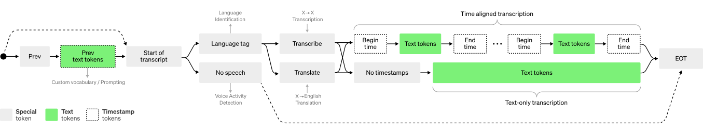

# Multimodal interaction, datasets, and synthetic generation

**Manuel Benavent Lledó, David Ortiz Pérez, and Jose García Rodríguez**

## Introduction

> **Definition**
>
> Modality refers to a certain type of information and/or representation format in which information is stored. There is a wide range of modalities: some raw modalities closer to sensor data such as speech signals and images, that can be expressed as language or detected objects, or going one step further, sentiment intensity or object categories.

**Why do we need to explore multimodal data?**

- From human perspective, we naturally interact with the world through multiple modalities, such as vision, language, and touch. Therefore, building systems that can understand and generate multimodal data enables more natural and intuitive human-computer interaction.
- From AI perspective, the information is present in different modalities and therefore it will often show diverse qualities, structures and representations. A comprehensive understanding of the different modalities will provide complementary information about a phenomenon. For example, in understanding a scene, combining visual data with textual descriptions can provide a more comprehensive understanding than using either modality alone.
- As a result, leveraging multiple modalities often leads to improved performance in various domains due to the richer representations of the data that enhance the robustness to noise and variability of the models. In this way, the lack of data from a modality (let's say an occlusion in a video) may be compensated with a different one (e.g., audio recordings). Moreover, multimodal data facilitates cross-modal learning, where knowledge from one modality can be transferred to another, enabling better generalization.

## Core Challenges in Multimodal Interaction

> Multimodal systems present a series of technical challenges that are understudied in conventional machine learning. This section covers the basic concepts, you may check bibliography for additional information in this area.
>
> (Optional) [**MultiModal Machine Learning Course from Carnegie Mellon University**](https://cmu-multicomp-lab.github.io/mmml-course/fall2023/)

### Representation

- **Definition:** Learning representations that reflect cross-modal interactions between individual elements, across different modalities.
  This is a core building block for most multimodal modeling problems. Individually, each modality can be seen as a “local” representation or a representation using holisitic features.
- **Sub-challenges**

  

### Alignment

- **Definition:** Identifying and modeling cross-modal connections between all elements of multiple modalities, building from the data structure.
  Most modalities have internal structure with multiple elements:

  
- **Sub-challenges:**

  

### Reasoning

- **Definition:** Combining knowledge, usually through multiple inferential steps, exploiting multimodal alignment and problem structure.
  For example, LLMs are a great source of external knowledge for multimodal reasoning.
- **Sub-challenges:**

  

### Generation

- **Definition:** Learning a generative process to produce raw modalities that reflects cross-modal interactions, structure and coherence.
- **Sub-challenges:**

  

### Transference

- **Definition:** Transfer knowledge between modalities, usually to help the target modality which may be noisy or with limited resources.

  
- **Sub-challenges:**

  

### Quantification

- **Definition:** Empirical and theoretical study to better understand heterogeneity, cross-modal interactions and the multimodal learning process.
- **Sub-challenges:**

  

### Real-World Challenges

Besides the technical challenges, in the real world multimodal systems have to face additional challenges.

- **Robustness**: to overcome noisy or missing data in some modalities.
- **Trustworthy**: people who use the system must trust it. It is preferable to have a system that does not provide an output (abstains) rather than making unclear predictions on noisy data or missing data.
- **Variability**: despite a dataset may be captured with high variability of subjects and locations, there are always unseen events that must be handled.
- **Fairness**: biases must be quantified and addressed to make the systems fair.
- **Privacy:** it is a crucial aspect when capturing data.

## Examples and Applications of Multimodality

### Multimodal architectures

#### **How to fuse data from different modalities?**

> (Optional) **Multimodal Learning with Transformers: A Survey.** Peng Xu, Xiatian Zhu, David A. Clifton https://doi.org/10.48550/arXiv.2206.06488

There are many ways of combining modalities but we can mainly categorize them in early, late or intermediate fusion strategies.

- Early fusion relies on the combination of modalities since the beginning, after the combination, the data is processed by the model. This method enables learning modality dependencies since the beginning. (See a and b in the figure.)
- Late fusion relies on the combination of modalities after being processed by individual models. With this processing of the data, we obtain modality features, which are combined for a multimodal result. This method enables the process of each modality independently, as each modality has different challenges. (See c in the figure.)
- Intermediate fusion relies in the combination of modalities while being processed by the models. This method enables learning dependencies since the beginning as well as facing modality challenges kind of individually. Examples are cross-attention strategies. (See e and f in the figure.)

In order to make the combinations of data modalities several options are available for combination, including concatenating the data, computing a sum, generating a weighted sum using static weights, weighting by a model parameter that may vary, or computing a product.

#### CLIP

> (Optional) **Learning Transferable Visual Models From Natural Language Supervision.** Alec Radford, Jong Wook Kim et al. https://doi.org/10.48550/arXiv.2103.00020

Use of contrastive learning to align visual and textual modalities. The primary advantage of this model is that it provides a pre-trained representation of the data using both images and text. This pre-existing knowledge is particularly useful in zero-shot learning scenarios for downstream tasks.

#### NeRF and Gaussian Splatting

> (Optional) **NeRF: Representing Scenes as Neural Radiance Fields for View Synthesis.** Mildenhall, B., Srinivasan, P. P., Tancik, M., Barron, J. T., Ramamoorthi, R., & Ng, R. https://doi.org/10.48550/arXiv.2003.08934

> (Optional) **3D Gaussian Splatting for Real-Time Radiance Field Rendering.** Kerbl, B., Kopanas, G., Leimkühler, T., & Drettakis, G. https://doi.org/10.48550/arXiv.2308.04079

Neural Radiance Fields (NeRF) and Gaussian Splatting stand out as two prominent techniques in 3D scene reconstruction. NeRF captures radiance fields from multiple viewpoints to produce photorealistic scenes. Although proficient at generating high-quality images, NeRF's computational demands render it less ideal for real-time applications, such as those needed for game engines like Unreal Engine, commonly used for synthetic data generation.

The Gaussial Splatting model initiates with camera calibration using Structure-from-Motion (SfM) alongside a sparse point cloud.
At rendering time, a process called Gaussian rasterization transforms each Gaussian particle into the appropriate red, blue and green colored pixels that make up each view.

This approach yields remarkable results with minimal input. Unlike methods that necessitate Multi-View Stereo (MVS) data, Gaussian Splatting employs an optimization procedure to generate a concise and accurate representation of the scene. Gaussian Splatting excels in producing smooth and continuous visualizations, making it suitable for applications where aesthetics and clarity are crucial. The training time for Gaussian splatting is approximately 50 times faster than NeRFs for the same or better quality.

Groundtruth vs Gaussian Splatting:

#### DALLE-2

> (Optional) **Hierarchical Text-Conditional Image Generation with CLIP Latents.** Aditya Ramesh, Prafulla Dhariwal, Alex Nichol, Casey Chu, Mark Chen https://doi.org/10.48550/arXiv.2204.06125

One of the state of the art models in text to image generation. This model uses a pretrained CLIP, we learn a joint representation space for text and images. A CLIP text embedding is fed into the diffusion prior model to generate an image embedding, and the using a diffusion decoder obtaining the final image. Explicitly generating the image embeddings using the diffusion prior improves the diversity of the data, but keeps the semantics and style, with a minimal loss.

> (Optional) **Diversify Your Vision Datasets with Automatic Diffusion-Based Augmentation** Dunlap, L., Umino, A., Zhang, H., Yang, J., Gonzalez, J. E., & Darrell, T. https://doi.org/10.48550/arXiv.2305.16289

> Link to an example of data augmentation using diffusion models. https://colab.research.google.com/drive/1wRW7yDLsCYC6JjcAzCFgOaHHJcLhCiEo?usp=sharing

#### Whisper

> (Optional) **Robust Speech Recognition via Large-Scale Weak Supervision.** Alec Radford, Jong Wook Kim, Tao Xu, Greg Brockman, Christine McLeavey, Ilya Sutskever https://doi.org/10.48550/arXiv.2212.04356

Whisper is the state of the art model in transcribing audio, obtaining the text that has been said on the audio. This model obtains a log mel-spectogram from the audio and uses convolutional neural networks to obtain the audio representation to feed a transformer. With this audio representation, the transformer decodes the text, and adds timestamps depending on which part of the audio is being processed. Whisper outperforms the rest of models, obtaining similar results as professional transcribers.

### Multimodal datasets

Data is crucial for deep learning and therefore multimodal datasets have been developed for different purposes. Some examples:

> (Optional) **ActionSense: A Multimodal Dataset and Recording Framework for Human Activities Using Wearable Sensors in a Kitchen Environment.** Joseph DelPreto et al. https://action-sense.csail.mit.edu/
>
> (Optional) **Multimodal Language Analysis in the Wild: CMU-MOSEI Dataset and Interpretable Dynamic Fusion Graph.**  Amir Zadeh et al. https://doi.org/10.18653/v1/P18-1208
>
> (Optional) **IEMOCAP: interactive emotional dyadic motion capture database.** Carlos Busso et al. https://doi.org/10.1007/s10579-008-9076-6
>
> (Optional) **Social-IQ: A Question Answering Benchmark for Artificial Social Intelligence** Amir Zadeh et al. https://doi.org/10.1109/CVPR.2019.00901

- **Overview of ActionSense sensors:**

  

### References:

> **Warning**
>
> References have been ***included along the text***, please review the material and find tip boxes marked as **Important**, which contain mandatory reading material.
>
> As explained in the previous chapter, **a test will be conducted** including topics covered in this material.

## Moodle test

* The moodle test will be developed during practice session on **Wednesday 7 May at 6pm CET**.
* The test has a maximum duration of 30 minutes from the start.
* The test consists of 20 triple choice questions.
* Each wrong answer subtracts 1/3 of the value of a correct answer.
* The mark for the test will be considered as one of the marks for the theoretical part of the course. See the overall evaluation of the course in the general conditions.
* The questions will be based on this webpage and all the mandatory readings proposed.

